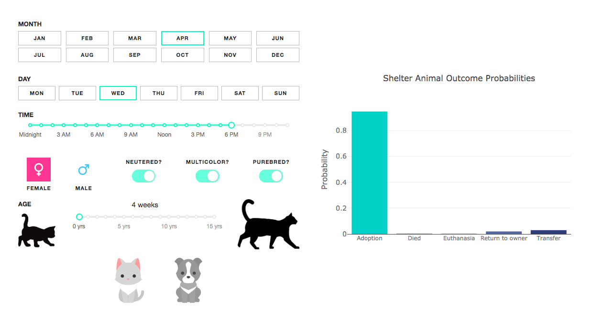

# Shelter Animal Outcome Predictor
This is a machine learning tool (Flask app) for predicting shelter animal outcome (adopted, died, euthanized, transfered or returned to owner).\
The main purpose of this tool is to serve and inspire local shelters to collect data about animals that may be useful for analysis, and to provide help to those animals who need it the most to avoid bad outcomes.\
\
The dataset was provided by the Austin Animal Center, the largest no-kill animal shelter in the United States, via the [Austin Open Data Portal](https://data.austintexas.gov/Health-and-Community-Services/Austin-Animal-Center-Outcomes/9t4d-g238).\
